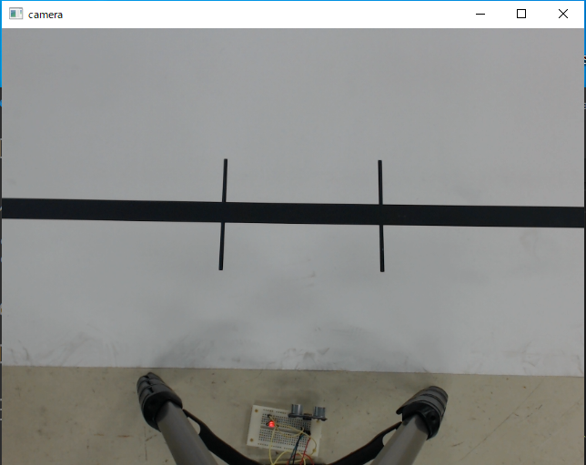
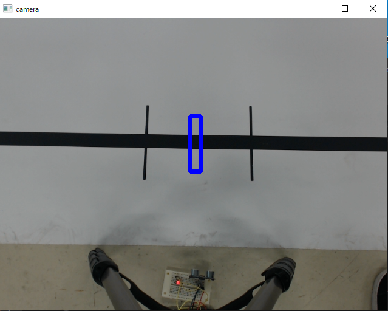
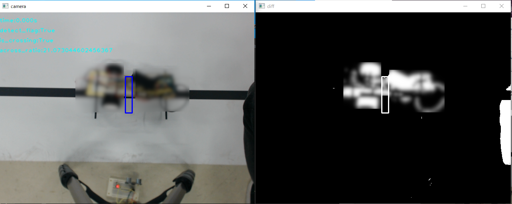
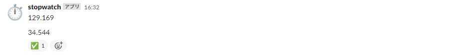

# ライントレース大会 時間計測プログラム

ライントレース大会や追従大会における周回コースの周回速度を画像処理で計測するプログラムです．  
計測結果はIncoming WebhookでSlackに送信し，結果を共有します．

確認済み実行環境
```
python==3.8.13
numpy==1.23.4
opencv-python==4.6.0.66
PyYAML==6.0
requests==2.28.1
```

必要なもの
- Webカメラ
- 三脚
- 適当なSlackのワークスペースとチャンネル（無くてもいいが，あった方が情報共有しやすい）

## インストール
Anaconda等でPythonの仮想環境を作ってから，以下でライブラリをインストール
```bash:pip
pip install -r requirements.txt
```

## 各ファイル説明
### stopwatch.py
時間計測プログラム

### conf.yml
設定ファイル  
詳細は[conf.ymlについて](AboutConf.md)  
特に，PCに接続されたどのWebカメラを使用するかは，`conf.yml`の`camera_id`で指定する．

### img
マニュアル用の画像

## 実行マニュアル
### 準備
カメラと三脚をセッティングする．  
なるべくカメラの向きは垂直にして，上からの撮影にする．

### (推奨)SlackのIncoming Webhookの設定
計測結果を送信したいSlackのチャンネルでIncoming Webhookの設定する．  
この設定はしなくてもいいが，その場合は計測結果がターミナルに表示されるだけで，情報の共有がしづらいため，設定推奨．  
計測結果が大量に送られるため，どうでもいいワークスペースやチャンネルを使用することを推奨．計測のためにワークスペースを新しく作るのもいい．  
Incoming Webhookの設定は検索か[このあたり](https://qiita.com/ik-fib/items/b4a502d173a22b3947a0)参照．

発行したwebhook URLを`conf.yml`の`web_hook_url`に設定する．

### プログラム実行
まずは時間計測プログラムを実行
```python
python stopwatch.py
```
それから，背景画像取得とスタートライン指定をしてから，時間計測する．

使いたいカメラとは違うWebカメラの映像が出たら，`conf.yml`の`camera_id`を変えて（+1して），再実行

### 背景画像取得
まずは背景画像を取得する．
  
以下の条件が揃ったら，Bキーを押して，背景画像を撮影する．
- カメラのピントが合う
- ロボットが写っていない
- （なるべく）人の影などが写っていない

Bキーを押したら，自動的に次のスタートライン指定モードになる

### スタートライン指定
次にスタートライン指定を指定する．
  
測定の基準になるスタートラインの範囲を長方形で指定する．

長方形の左上部分でマウスの左ボタンを押して，そのままドラッグし，長方形の右下部分でマウスの左ボタンを離す（ドロップ）
そうすると，指定した長方形が描画される．
指定した長方形（スタートライン）が気に入らなかった場合は，もう一度長方形を指定すれば変えられる．

スタートラインが決まったら，Sキーを押すと，時間計測モードに進む．

### 時間計測
ここから，自動で時間が計測される．  
計測を終えるときは，pythonプログラムを実行しているターミナルの方でCtrl+Cなどで中断する．

Webカメラの映像と背景差分の二値化映像，二つのウィンドウが表示する．
（下の画像はどちらもロボットをぼかしている．）  
指定したスタートラインの範囲で，背景差分の検出面積がある一定以上超えたら，ロボットが通過したとして，ラップタイムを計測する．  


計測した結果はwebhookを設定したSlackのチャンネルに送信される．  
送信される計測結果がすべて有効とは限らないため，有効な結果には記録係がリアクションを着けるなど，分かるようにする．  

ネット接続が途切れていたり，webhook URLが無効でも，ターミナルには計測結果が表示される．